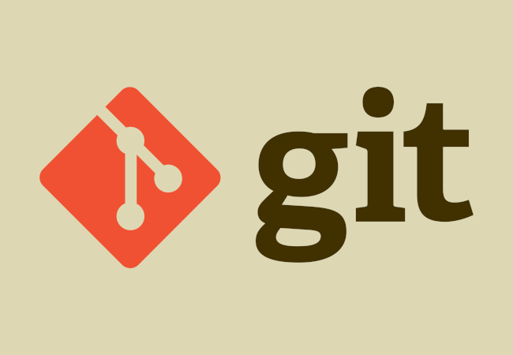

# Git Learning Journey | Version Control

<p float="center">
    
</p>

## Project Overview
This repository documents my **Git and GitHub learning journey** as I explored version control systems and collaborative development workflows. Through continuous practice and hands-on projects, I learned how developers manage, track, and organize code efficiently across different environments and teams.

The journey strengthened my understanding of professional software development practices while improving my ability to manage repositories, maintain project history, and collaborate effectively using GitHub.

---

## Key Features
* **Version Control Fundamentals:** Understanding repositories, commits, branches, and merges.
* **GitHub Collaboration:** Working with pull requests, forks, and remote repositories.
* **Workflow Management:** Organizing and tracking project progress professionally.
* **Code Tracking:** Monitoring project changes using commit history and version snapshots.
* **Project Organization:** Structuring repositories for clean and scalable development.

---

## Tech Stack
* **Version Control:** Git
* **Platform:** GitHub
* **Development Tools:** VS Code, Git Bash
* **Workflow Practices:** Branching, Pull Requests, Repository Management

---

## Learning Workflow
1. **Git Fundamentals:** Learning repositories, commits, staging, and branching.
2. **Repository Management:** Creating and organizing local and remote repositories.
3. **Collaboration Workflow:** Understanding pull requests, forks, and project sharing.
4. **Version Tracking:** Managing project updates and maintaining clean commit histories.
5. **Continuous Practice:** Applying Git workflows across software development projects.

---

```
